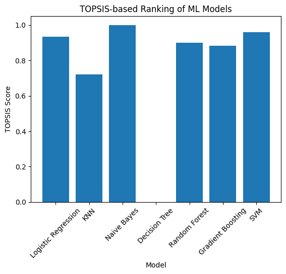

Data Generation using Modelling and Simulation for Machine Learning
=================================================================================

Football Match Outcome Prediction using Monte Carlo Simulation and TOPSIS
-------------------------------------------------------------------------

**Course:** UCS654 -- Predictive Analytics using Statistics\
**Assignment:** Assignment-6\
**Author:** Nimish Agrawal\
**Roll Number:** 102483077

* * * * *

📌 About the Project
--------------------

This project demonstrates the use of **modelling and simulation** to generate synthetic data for machine learning applications. A **football (soccer) match simulation** was developed using **Monte Carlo simulation** to model match outcomes under uncertainty.

The generated data was then used to train and evaluate multiple **classification machine learning models**. To ensure objective model selection, the **TOPSIS (Technique for Order of Preference by Similarity to Ideal Solution)** method was applied using multiple evaluation metrics.

* * * * *

🎯 Objective
------------

-   To generate synthetic data using a simulation-based approach

-   To create **1500 simulated football matches**

-   To apply and compare multiple ML classification models

-   To evaluate models using **five performance metrics**

-   To select the best model using **TOPSIS**

* * * * *

⚙️ Simulation Tool and Technique
--------------------------------

**Simulation Technique:** Monte Carlo Simulation\
**Implementation:** Python (NumPy)

Monte Carlo simulation is suitable for football analytics as match outcomes involve randomness and probabilistic goal scoring. Goals were simulated using a Poisson distribution, a commonly accepted model in sports analytics.

* * * * *

🔢 Simulation Parameters and Bounds
-----------------------------------

| Parameter | Description | Lower Bound | Upper Bound |
| --- | --- | --- | --- |
| home_attack | Home team attacking strength | 0.5 | 2.0 |
| home_defense | Home team defensive strength | 0.5 | 2.0 |
| away_attack | Away team attacking strength | 0.5 | 2.0 |
| away_defense | Away team defensive strength | 0.5 | 2.0 |
| home_advantage | Home ground advantage | 1.0 | 1.5 |

* * * * *

📤 Simulation Output
--------------------

Each simulated match produces:

-   Home goals

-   Away goals

-   Match outcome

### Match Outcome Encoding

| Outcome | Label |
| --- | --- |
| Away Win | 0 |
| Draw | 1 |
| Home Win | 2 |

* * * * *

📊 Dataset Generation
---------------------

-   **Total simulations:** 1500

-   **Dataset type:** Synthetic

-   **Saved file:** `Data/simulated_matches.csv`

* * * * *

🤖 Machine Learning Models Used
-------------------------------

The following **seven classification models** were trained and evaluated:

-   Logistic Regression

-   K-Nearest Neighbors (KNN)

-   Naive Bayes

-   Decision Tree

-   Random Forest

-   Gradient Boosting

-   Support Vector Machine (SVM)

* * * * *

📐 Evaluation Metrics
---------------------

Five evaluation metrics were used:

| Metric | Description |
| --- | --- |
| Accuracy | Overall correctness |
| Precision | Correctness of positive predictions |
| Recall | Ability to identify all classes |
| F1-score | Balance between precision and recall |
| Log Loss | Confidence of probability predictions |

Multiple evaluation metrics were selected to capture different aspects of model performance. Accuracy provides an overall measure of correctness, while precision and recall evaluate how well each model handles class-wise predictions. The F1-score balances precision and recall, making it suitable for multi-class match outcome prediction. Log loss measures the confidence of probability estimates and penalizes incorrect predictions more heavily. Together, these metrics ensure a comprehensive and unbiased comparison of classification models.

* * * * *

📋 Model Evaluation Results
---------------------------

📁 **File:** `Data/model_evaluation.csv`

| Model | Accuracy | Precision | Recall | F1-score | Log Loss |
| --- | --- | --- | --- | --- | --- |
| Logistic Regression | 0.586667 | 0.498570 | 0.491738 | 0.447989 | 0.921939 |
| KNN | 0.496667 | 0.445334 | 0.455172 | 0.446760 | 5.703128 |
| Naive Bayes | 0.590000 | 0.556033 | 0.496905 | 0.469699 | 0.927380 |
| Decision Tree | 0.430000 | 0.396670 | 0.395225 | 0.394792 | 20.544882 |
| Random Forest | 0.543333 | 0.472002 | 0.471805 | 0.456365 | 0.989980 |
| Gradient Boosting | 0.546667 | 0.454981 | 0.465635 | 0.445643 | 0.989236 |
| SVM | 0.573333 | 0.525433 | 0.481216 | 0.461559 | 0.959034 |

* * * * *

📈 Graphical Analysis
---------------------

Five separate graphs were generated to compare all models across each metric:

1.  Accuracy Comparison

2.  Precision Comparison

3.  Recall Comparison

4.  F1-score Comparison

5.  Log Loss Comparison

📁 **Graphs location:** `Graphs/`

* * * * *

🧮 TOPSIS-Based Model Selection
-------------------------------

To avoid selecting a model based on a single metric, **TOPSIS** was applied using all five evaluation metrics.

### Metrics Used in TOPSIS

| Metric | Nature |
| --- | --- |
| Accuracy | Benefit |
| Precision | Benefit |
| Recall | Benefit |
| F1-score | Benefit |
| Log Loss | Cost |

📁 **File:** `FinalResult.csv`

* * * * *

🏆 Final Model Ranking (TOPSIS)
-------------------------------

| Model | TOPSIS Score | Rank |
| --- | --- | --- |
| Naive Bayes | 0.999734 | 1 |
| SVM | 0.958202 | 2 |
| Logistic Regression | 0.932826 | 3 |
| Random Forest | 0.899704 | 4 |
| Gradient Boosting | 0.882801 | 5 |
| KNN | 0.721472 | 6 |
| Decision Tree | 0.000000 | 7 |

* * * * *

✅ Final Conclusion
------------------

Based on the TOPSIS analysis, **Naive Bayes** emerged as the best-performing classification model for the simulated football match dataset. It achieved the highest TOPSIS score by maintaining a strong balance across accuracy, precision, recall, F1-score, and log loss.

This project demonstrates how **modelling and simulation**, combined with **multi-criteria decision-making**, can be effectively used to generate data and select optimal machine learning models in uncertain real-world scenarios such as sports analytics.